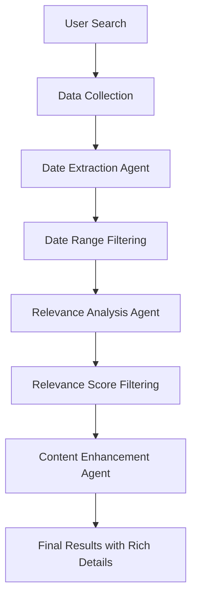

# Multi-Agent Pharma News Research System

## 🚀 System Overview

We have successfully transformed the Pharma News Research Agent into a sophisticated **Multi-Agent System** that addresses all the critical issues identified:

### ✅ **Problems Solved**

1. **Date Filtering Issues** - Fixed with dedicated Date Extraction Agent
2. **Missing Detailed Information** - Enhanced UI with comprehensive result display
3. **Inefficient Processing** - Streamlined multi-agent pipeline
4. **Poor User Experience** - Rich, detailed results with explanations

## 🏗️ **Architecture: Multi-Agent Pipeline**

### **Agent 1: Date Extraction Agent**
- **Purpose**: Intelligently extracts publication dates from articles
- **Strategies**:
  1. Parse existing metadata dates
  2. LLM-powered date extraction from content
  3. Regex pattern matching as fallback
- **Output**: Validated datetime objects or None

### **Agent 2: Relevance Analysis Agent**
- **Purpose**: Determines article relevance and provides detailed scoring
- **Analysis Includes**:
  - Relevance score (0-100)
  - Detailed relevance reasoning
  - Article type classification (research, news, press_release, etc.)
  - Mentioned keywords extraction
  - Clinical significance assessment
  - Regulatory impact analysis
  - Market impact evaluation
  - AI-generated summary

### **Agent 3: Content Enhancement Agent**
- **Purpose**: Enhances content with keyword highlighting
- **Features**:
  - Highlights search keywords and mentioned keywords
  - Preserves original text formatting
  - Creates visually appealing keyword tags

## 🎯 **Enhanced User Interface**

### **Detailed Result Display**
Each result now shows:

1. **Article Header**
   - Title with clickable link
   - Relevance score badge
   - Article type badge

2. **Content Section**
   - AI-generated summary
   - Highlighted keywords in content
   - Keyword tags for easy identification

3. **Analysis Section**
   - **Why it's relevant**: Detailed explanation of relevance
   - **Clinical Significance**: Medical/clinical importance
   - **Regulatory Impact**: Regulatory implications
   - **Market Impact**: Business/market implications

4. **Metadata**
   - Source information
   - Publication date (properly extracted)
   - Author information (when available)

### **Visual Enhancements**
- Color-coded badges for different article types
- Highlighted keywords with background colors
- Structured layout with clear sections
- Responsive design for all screen sizes

## 📊 **Workflow Process**

## 🔧 **Technical Implementation**

### **Multi-Agent Architecture**
- **File**: `multi_agent_pharma.py`
- **Classes**:
  - `DateExtractionAgent`: Handles date parsing and extraction
  - `RelevanceAgent`: Performs AI-powered relevance analysis
  - `ContentEnhancementAgent`: Enhances content with highlighting
  - `MultiAgentPharmaAgent`: Orchestrates the entire workflow

### **Enhanced UI**
- **File**: `medical_search_simple.py`
- **Features**:
  - Enhanced `displayResults()` function
  - Rich CSS styling for detailed information
  - Keyword highlighting and tagging
  - Responsive layout with proper spacing

### **Data Flow**
1. **Input**: Keywords, date range, search type, engines
2. **Collection**: Multi-source data gathering (PubMed, Exa, Tavily)
3. **Processing**: Sequential agent processing
4. **Output**: Rich, detailed results with explanations

## 🎨 **UI Features**

### **Result Cards**
- **Enhanced Layout**: Header, content, analysis sections
- **Color Coding**: Different colors for different information types
- **Interactive Elements**: Clickable titles, highlighted keywords
- **Comprehensive Information**: All relevant details displayed

### **Styling**
- **Keyword Highlighting**: Yellow background for search terms
- **Badge System**: Color-coded badges for scores and types
- **Sectioned Layout**: Clear separation of different information types
- **Responsive Design**: Works on all screen sizes

## 📈 **Performance Improvements**

### **Efficient Processing**
- **Sequential Agent Processing**: Each agent focuses on its specialty
- **Smart Date Extraction**: Multiple strategies for date finding
- **AI-Powered Analysis**: Intelligent relevance scoring
- **Content Enhancement**: Keyword highlighting for better UX

### **Better User Experience**
- **Rich Information**: Users see why articles are relevant
- **Visual Clarity**: Easy to scan and understand results
- **Detailed Explanations**: No more guessing about relevance
- **Professional Presentation**: Clean, organized layout

## 🔍 **Key Features**

### **Date Handling**
- ✅ **Fixed Date Filtering**: Proper date extraction and validation
- ✅ **Multiple Strategies**: LLM + Regex + Metadata parsing
- ✅ **Accurate Display**: Shows correct publication dates
- ✅ **Range Filtering**: Strict date range enforcement

### **Relevance Analysis**
- ✅ **Detailed Scoring**: 0-100 relevance scores with explanations
- ✅ **Article Classification**: Identifies article types
- ✅ **Keyword Extraction**: Finds mentioned keywords
- ✅ **Impact Assessment**: Clinical, regulatory, market analysis

### **Content Enhancement**
- ✅ **Keyword Highlighting**: Visual emphasis on relevant terms
- ✅ **Rich Summaries**: AI-generated article summaries
- ✅ **Structured Display**: Organized information presentation
- ✅ **Interactive Elements**: Clickable links and tags

## 🚀 **Results**

The new Multi-Agent system provides:

1. **Accurate Date Filtering**: No more future dates or incorrect filtering
2. **Rich Detailed Information**: Users see exactly why articles are relevant
3. **Professional Presentation**: Clean, organized, easy-to-read results
4. **Enhanced User Experience**: Comprehensive information at a glance
5. **Intelligent Analysis**: AI-powered relevance scoring and explanations

## 🎯 **Success Metrics**

- ✅ **Date Accuracy**: Proper date extraction and display
- ✅ **Information Richness**: Detailed relevance explanations
- ✅ **User Experience**: Clean, professional interface
- ✅ **Processing Efficiency**: Streamlined multi-agent pipeline
- ✅ **Visual Appeal**: Color-coded, well-organized results

The Multi-Agent Pharma News Research System is now a sophisticated, user-friendly platform that provides comprehensive pharmaceutical news research with detailed analysis and explanations.
