# User Flow Diagram - Pharma News Research Agent

## Complete User Journey with Detailed Explanations

```mermaid
flowchart TD
    Start([User Visits Application]) --> Landing[Landing Page<br/>Root: /]
    
    Landing --> |Views Features| LandingFeatures{User Reviews<br/>Features}
    LandingFeatures --> |Clicks 'Get Started'| OMEHome
    LandingFeatures --> |Clicks 'Health Check'| HealthCheck[Health Check Page<br/>/OME/health]
    
    HealthCheck --> |Views API Status| HealthInfo[Shows:<br/>✓ OpenAI Status<br/>✓ Tavily Status<br/>✓ Exa Status<br/>✓ NewsAPI Status<br/>✓ System Health]
    HealthInfo --> |Returns to Main| OMEHome
    
    OMEHome[OME Agent Home<br/>/OME/]
    OMEHome --> TabSelect{User Selects Tab}
    
    TabSelect --> |Single Search| SingleSearch[Single Search Tab]
    TabSelect --> |Batch Processing| BatchTab[Batch Processing Tab]
    TabSelect --> |Results History| HistoryTab[Results History Tab]
    
    %% Single Search Flow
    SingleSearch --> QuickFill{Use Quick Fill?}
    QuickFill --> |Yes - Prostate Cancer| FillProstate[Auto-fill:<br/>prostate cancer, orgovyx,<br/>relugolix, myfembree, OAB]
    QuickFill --> |Yes - AI in Pharma| FillAI[Auto-fill:<br/>AI, machine learning,<br/>RAG, LLM, drug discovery]
    QuickFill --> |No - Manual Entry| ManualEntry
    
    FillProstate --> ManualEntry[Enter Search Parameters]
    FillAI --> ManualEntry
    
    ManualEntry --> EnterKeywords[1. Enter Keywords<br/>Comma-separated list]
    EnterKeywords --> EnterDates[2. Select Date Range<br/>Start & End Date]
    EnterDates --> SelectType[3. Choose Search Type<br/>- Standard<br/>- Title Only<br/>- Co-occurrence]
    SelectType --> OptionalFields[4. Optional Fields<br/>- Alert Name<br/>- Section Name]
    OptionalFields --> SelectEngines[5. Select Search Engines<br/>☑ PubMed<br/>☑ Exa<br/>☑ Tavily<br/>☑ NewsAPI]
    
    SelectEngines --> ClickSearch[Click 'Start Research']
    ClickSearch --> ProcessingOverlay[Loading Overlay Appears<br/>Shows Progress Bar]
    
    ProcessingOverlay --> BackendProcess[Backend Processing]
    BackendProcess --> Step1[Step 1: Data Collection<br/>Queries selected APIs]
    Step1 --> Step2[Step 2: Deduplication<br/>Removes near-duplicates<br/>using title similarity]
    Step2 --> Step3[Step 3: Date Extraction<br/>LLM extracts dates from<br/>content, URLs, metadata]
    Step3 --> Step4[Step 4: Date Filtering<br/>Keeps articles in<br/>specified date range]
    Step4 --> Step5[Step 5: Relevance Analysis<br/>AI scores each article<br/>0-100 relevance score]
    Step5 --> Step6[Step 6: Content Enhancement<br/>Highlights keywords<br/>Generates summaries]
    Step6 --> Step7[Step 7: Results Assembly<br/>Sorts by relevance<br/>Adds metadata]
    
    Step7 --> DisplayResults[Display Results on Page]
    DisplayResults --> UpdateStats[Update Statistics<br/>Left Sidebar Shows:<br/>- Total Collected<br/>- Duplicates Removed<br/>- Dates Extracted<br/>- Articles Analyzed]
    
    UpdateStats --> ViewResults{User Views Results}
    ViewResults --> |Scroll Through| ResultCard[Each Result Card Shows:<br/>- Title with Link<br/>- Relevance Score<br/>- Article Type<br/>- Summary<br/>- Why It's Relevant<br/>- Keywords Found<br/>- Clinical Significance<br/>- Regulatory Impact<br/>- Market Impact<br/>- Source & Date]
    
    ResultCard --> FilterResults{Use Filters?}
    FilterResults --> |Yes| AdjustSlider[Adjust Relevance Slider<br/>Min Score: 0-100<br/>Hides low-score articles]
    AdjustSlider --> FilteredView[View Filtered Results<br/>Shows/Hidden Count]
    FilteredView --> NextAction
    FilterResults --> |No| NextAction{What Next?}
    
    NextAction --> |Export Results| DownloadCSV[Click Download CSV<br/>Generates CSV with:<br/>- Rank<br/>- Title<br/>- Summary<br/>- Source<br/>- Date<br/>- URL<br/>- Relevance Score]
    NextAction --> |New Search| ManualEntry
    NextAction --> |Different Tab| TabSelect
    
    DownloadCSV --> CSVFile[CSV File Downloaded<br/>Filename: medical_search_<br/>keywords_timestamp.csv]
    CSVFile --> NextAction
    
    %% Batch Processing Flow
    BatchTab --> UploadCSV[Upload CSV File<br/>Required columns:<br/>- aliases<br/>- keywords<br/>- search_type<br/>- subheader<br/>- header<br/>- user]
    UploadCSV --> DragDrop{Upload Method}
    DragDrop --> |Click to Upload| FileSelect[Select CSV File<br/>from Computer]
    DragDrop --> |Drag & Drop| FileDrop[Drop CSV File<br/>into Upload Area]
    
    FileSelect --> ParseCSV[Parse CSV File]
    FileDrop --> ParseCSV
    
    ParseCSV --> ValidateCSV{Valid CSV?}
    ValidateCSV --> |No| ErrorMsg[Show Error Message<br/>Display Issue]
    ValidateCSV --> |Yes| ShowSections[Display Sections Found<br/>Shows:<br/>- Total Sections<br/>- Users<br/>- Keywords per Section]
    
    ErrorMsg --> UploadCSV
    ShowSections --> SelectUser[Select User Filter<br/>Optional]
    SelectUser --> SelectBatchDates[Select Date Range<br/>for Batch Search]
    SelectBatchDates --> ProcessBatch[Process All Sections]
    
    ProcessBatch --> BatchLoop[For Each Section:<br/>1. Run Search<br/>2. Apply Filters<br/>3. Score Articles<br/>4. Store Results]
    BatchLoop --> BatchResults[Show Results by Section<br/>Organized by:<br/>- User<br/>- Header<br/>- Subheader]
    
    BatchResults --> DownloadBatch[Download Multi-Section CSV<br/>Includes all sections<br/>with context metadata]
    DownloadBatch --> NextAction
    
    %% Results History Flow
    HistoryTab --> HistoryList[View Previous Searches<br/>Last 10 sessions stored<br/>in memory]
    HistoryList --> SelectHistory{Select Session?}
    SelectHistory --> |Yes| LoadHistory[Load Previous Results<br/>Restores all data]
    SelectHistory --> |No| TabSelect
    LoadHistory --> ViewResults
    
    %% Activity Monitoring
    ViewResults -.-> ActivityLog[Activity Log<br/>Right Sidebar<br/>Shows Live Updates:<br/>- Search Started<br/>- Keywords Used<br/>- Results Found<br/>- Errors/Warnings<br/>- Timestamps]
    
    BackendProcess -.-> ActivityLog
    ProcessingOverlay -.-> ActivityLog
    
    %% Error Handling
    BackendProcess --> |Error| ErrorHandler{Error Type?}
    ErrorHandler --> |Network Error| NetworkError[Show Network Error<br/>Retry Option]
    ErrorHandler --> |API Error| APIError[Show API Error<br/>Check API Status]
    ErrorHandler --> |Validation Error| ValidationError[Show Validation Error<br/>Fix Input]
    
    NetworkError --> ManualEntry
    APIError --> ManualEntry
    ValidationError --> ManualEntry
    
    %% Styling
    classDef startEnd fill:#667eea,stroke:#764ba2,stroke-width:3px,color:#fff
    classDef process fill:#3498db,stroke:#2980b9,stroke-width:2px,color:#fff
    classDef decision fill:#f39c12,stroke:#e67e22,stroke-width:2px,color:#fff
    classDef data fill:#27ae60,stroke:#229954,stroke-width:2px,color:#fff
    classDef error fill:#e74c3c,stroke:#c0392b,stroke-width:2px,color:#fff
    classDef result fill:#9b59b6,stroke:#8e44ad,stroke-width:2px,color:#fff
    
    class Start,Landing startEnd
    class ManualEntry,ProcessingOverlay,BackendProcess,Step1,Step2,Step3,Step4,Step5,Step6,Step7 process
    class TabSelect,QuickFill,FilterResults,NextAction,DragDrop,ValidateCSV,SelectHistory,ErrorHandler decision
    class ResultCard,CSVFile,ShowSections,BatchResults,HistoryList,ActivityLog data
    class NetworkError,APIError,ValidationError,ErrorMsg error
    class DisplayResults,FilteredView,HealthInfo result
```



---

## Detailed Flow Explanations

### 1. Landing Page (Entry Point)
**Route**: `/`

**What User Sees**:
- Beautiful gradient purple theme
- Large "🚀" emoji
- System status indicator (✓ System Online)
- Feature grid with 4 key features
- Two action buttons

**User Actions**:
- Click "Get Started" → Goes to `/OME/`
- Click "Health Check" → Goes to `/OME/health`
- Review features before deciding

---

### 2. Health Check Page
**Route**: `/OME/health`

**Purpose**: Show system and API status

**Information Displayed**:
```json
{
  "status": "healthy",
  "timestamp": "2024-10-17T15:30:00",
  "api_status": {
    "openai_configured": true,
    "tavily_configured": true,
    "exa_configured": true,
    "newsapi_configured": true,
    "pubmed_configured": true
  },
  "agentic_workflow": {
    "available": true,
    "initialized": true
  }
}
```

---

### 3. OME Agent Home
**Route**: `/OME/`

**Layout**:
- **Left Sidebar**: Session stats, search engines, API status
- **Main Content**: Tab interface (Single Search, Batch, History)
- **Right Sidebar**: Live activity log, filters

**Initial State**:
- Default date range: Last 7 days
- All search engines selected
- Standard search type
- Empty keywords field

---

### 4. Single Search Tab

#### Step-by-Step User Journey:

**Step 1: Quick Fill (Optional)**
- User can click "🏥 Prostate Cancer" button
  - Auto-fills: `prostate cancer, orgovyx, relugolix, myfembree, OAB, overactive bladder, urology, oncology, hormone therapy, ADT`
  - Sets alert name: "Prostate Cancer & Urology Research"
  - Sets section: "Clinical Updates"
  
- Or click "🤖 AI in Pharma" button
  - Auto-fills: `AI, artificial intelligence, machine learning, RAG, LLM, agentic, pipelines, pharma, drug discovery, clinical trials AI`
  - Sets alert name: "AI in Pharma Research"
  - Sets section: "Technology & Innovation"

**Step 2: Manual Entry**
- **Keywords**: Comma-separated list (max 100)
  - Example: `immunotherapy, checkpoint inhibitors, PD-1, PD-L1`
  
- **Date Range**: 
  - Start Date (default: 7 days ago)
  - End Date (default: today)
  
- **Search Type**:
  - **Standard**: Any keyword in title OR content
  - **Title Only**: Any keyword must be in title
  - **Co-occurrence**: 2+ keywords must be in content

- **Optional Fields**:
  - Alert Name: For organizing searches
  - Section Name: For categorization

**Step 3: Select Search Engines**
- ☑ PubMed (Medical literature)
- ☑ Exa (Neural search)
- ☑ Tavily (Web search)
- ☑ NewsAPI (News articles)

**Step 4: Submit Search**
- Click "🔍 Start Research" button
- Loading overlay appears with:
  - Spinner animation
  - Progress bar (0% → 100%)
  - Status messages

---

### 5. Backend Processing (Multi-Agent Workflow)

#### Agent 1: Data Collection Agent
**Function**: Query all selected APIs

**Process**:
1. Send parallel requests to checked APIs
2. Parse responses
3. Normalize data format
4. Combine results

**Output**: Raw articles list

---

#### Agent 2: Deduplication Agent
**Function**: Remove near-duplicate articles

**Algorithm**:
```python
similarity = SequenceMatcher(title1, title2).ratio()
if similarity >= 0.75:
    mark_as_duplicate()
```

**Process**:
1. Compare all article titles pairwise
2. Group similar articles (≥75% similarity)
3. Keep article with most content
4. Remove duplicates

**Stats Tracked**:
- Duplicates removed
- Unique articles
- Duplicate groups

---

#### Agent 3: Date Extraction Agent
**Function**: Extract publication dates using LLM + regex

**Strategies** (in order):
1. Parse existing date field
2. LLM extraction from content/URL/metadata
3. Regex patterns (URLs, content)

**LLM Prompt**:
```
Extract publication date from:
- URL: /2024/03/15/article
- Title: "Study Published March 15, 2024"
- Content: "Posted on 2024-03-15..."

Return: YYYY-MM-DD or "none"
```

**Stats Tracked**:
- Articles with dates
- Articles without dates
- LLM-extracted dates

---

#### Agent 4: Date Filtering Agent
**Function**: Keep only articles in date range

**Process**:
1. Check if article has extracted_date
2. Compare: start_date ≤ extracted_date ≤ end_date
3. Keep or discard

**Special Cases**:
- No date → Discard (even after LLM attempted extraction)
- LLM rescued → Track as "LLM rescued" metric

**Stats Tracked**:
- In range
- Out of range
- LLM rescued (had no date, LLM found one, passed filter)

---

#### Agent 5: Relevance Analysis Agent
**Function**: AI-powered relevance scoring (0-100)

**LLM Analysis** (GPT-4o-mini):
```json
{
  "relevance_score": 85,
  "relevance_reason": "Discusses prostate cancer immunotherapy trial results",
  "article_type": "research",
  "mentioned_keywords": ["prostate cancer", "immunotherapy", "clinical trial"],
  "clinical_significance": "Phase 3 trial shows 30% improvement",
  "regulatory_impact": "Potential FDA fast-track designation",
  "market_impact": "Could capture $2B market by 2027",
  "summary": "New immunotherapy shows promise..."
}
```

**Scoring Criteria**:
- 90-100: Perfect match, highly relevant
- 80-89: Very relevant, important news
- 70-79: Relevant, useful information
- 60-69: Somewhat relevant
- 50-59: Barely relevant
- 0-49: Not relevant

**Stats Tracked**:
- Articles analyzed
- Analysis failures

---

#### Agent 6: Relevance Filtering Agent
**Function**: Filter by minimum score

**Default Threshold**: 40/100

**Process**:
1. Check relevance_score
2. Keep if score ≥ 40
3. Discard if score < 40

**Stats Tracked**:
- Articles kept
- Articles filtered out

---

#### Agent 7: Content Enhancement Agent
**Function**: Highlight keywords in content

**Process**:
1. Get all keywords (search + mentioned)
2. Find in content (case-insensitive)
3. Wrap with `<mark class="keyword-highlight">`
4. Return highlighted content

**Output**: HTML with highlighted keywords

---

### 6. Results Display

#### Result Card Format:
```
┌─────────────────────────────────────────┐
│ [TITLE with URL]            Score: 85   │
│                             Type: research│
├─────────────────────────────────────────┤
│ Summary with highlighted keywords...     │
│                                          │
│ Why it's relevant:                       │
│ Discusses prostate cancer trial results │
│                                          │
│ Keywords: [prostate] [cancer] [trial]   │
│                                          │
│ Clinical Significance:                   │
│ Phase 3 trial shows improvement         │
│                                          │
│ Regulatory Impact:                       │
│ FDA fast-track potential                │
│                                          │
│ Market Impact:                           │
│ $2B market opportunity                   │
│                                          │
│ Source: PubMed | 📅 2024-10-15          │
└─────────────────────────────────────────┘
```

---

### 7. Statistics Sidebar (Left)

**Session Stats**:
- Total Searches: 3
- Results Found: 47
- Sources Used: 4

**Data Collection**:
- Total Collected: 125
- Sources: pubmed, exa, tavily, newsapi

**Deduplication**:
- Duplicates Removed: 23
- Unique Articles: 102
- Duplicate Groups: 8

**Date Extraction**:
- With Dates: 89
- Without Dates: 13
- LLM Extracted: 45

**Date Filtering**:
- In Range: 78
- Out of Range: 11
- LLM Rescued: 12

**Relevance Analysis**:
- Analyzed: 78
- Kept (≥40): 47
- Filtered: 31

---

### 8. Activity Log (Right Sidebar)

**Live Updates**:
```
15:30:45 | Starting search with pubmed, exa, tavily
15:30:46 | Keywords: prostate cancer, immuno...
15:30:52 | Found 125 results
15:30:53 | Deduplication: removed 23 duplicates
15:30:54 | Date extraction: 89 with dates
15:30:58 | Relevance analysis: 47 kept
15:30:59 | ✓ Search complete
```

**Color Coding**:
- 🔵 Info: Blue border
- ✅ Success: Green border
- ⚠️ Warning: Orange border
- ❌ Error: Red border

---

### 9. Filtering Interface

**Relevance Slider** (Right sidebar):
```
Min Score: [        |        ] 50
           0                 100
           
Shown: 32 articles
Hidden: 15 articles
```

**Real-time Updates**:
- Move slider → Instantly hide/show cards
- Cards with score < threshold disappear
- Statistics update immediately

---

### 10. CSV Export

**Click Download** → Generates CSV:

```csv
Rank,Title,Summary,Source,Date,URL,Relevance Score
1,"Prostate Cancer Study...","Summary...","PubMed","2024-10-15","https://...","85"
2,"Immunotherapy Trial...","Summary...","Exa","2024-10-14","https://...","82"
...
```

**Filename**: `medical_search_prostate_cancer_immunotherapy_20241017_153059.csv`

---

### 11. Batch Processing Tab

**CSV Format**:
```csv
aliases,keywords,search_type,subheader,header,user
"prostate,PCa","cancer,treatment","standard","Clinical","Oncology","Dr. Smith"
"checkpoint,PD-1","inhibitors,trial","title","Trials","Oncology","Dr. Smith"
```

**Process**:
1. Upload CSV
2. Parse sections (combines aliases + keywords)
3. Select user filter (optional)
4. Select date range
5. Process each section independently
6. Download consolidated results with section context

**Output CSV** includes all original columns + results

---

### 12. Error Handling

**Network Error**:
- Shows: "Network error: Connection timeout"
- Action: Retry button, returns to form

**API Error**:
- Shows: "API error: Invalid API key"
- Action: Check API status link

**Validation Error**:
- Shows: "Keywords are required"
- Action: Highlight field, show message

**Parsing Error**:
- Shows: "JSON parsing failed, article may be relevant"
- Action: Assigns neutral score (50), continues

---

## User Experience Flow Summary

### Happy Path (Successful Search):
1. User arrives at landing page (5 seconds)
2. Clicks "Get Started" → OME home (instant)
3. Clicks "Prostate Cancer" quick fill (instant)
4. Adjusts date range (5 seconds)
5. Clicks "Start Research" (instant)
6. Watches progress bar (10-30 seconds)
7. Views 47 results sorted by relevance (instant)
8. Adjusts filter slider to 60 (instant)
9. Reviews 32 high-quality results (2-10 minutes)
10. Downloads CSV (instant)
11. Job done! ✓

**Total Time**: 3-11 minutes (mostly reading results)
**Technical Time**: ~30 seconds (actual processing)

---

## Key User Benefits

1. **Quick Start**: Pre-filled templates save time
2. **Visual Feedback**: Progress bar, live activity log
3. **Smart Filtering**: AI removes low-quality results
4. **Rich Context**: Each result has detailed analysis
5. **Flexible Export**: CSV for further analysis
6. **Batch Support**: Process many queries at once
7. **Error Recovery**: Clear messages, retry options

---

## Mobile Responsive Behavior

**Breakpoint**: 768px

**Changes on Mobile**:
- 3-column layout → Single column
- Sidebars collapse to accordions
- Feature grid: 2 columns → 1 column
- Buttons: Smaller padding
- Font sizes: Reduced 20%
- Touch-friendly: Larger tap targets

---

This flowchart represents the complete user journey through the Pharma News Research Agent!

